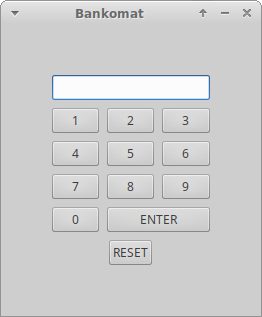

# PracaDomowaInstrukcjaWarunkowa
## Zadanie 1
### Plik o nazwie bankomat.cpp
```c++
#include <iostream>

using namespace std;

string PIN;

int main()
{
    cout << "Witaj w naszym banku!" << endl;
    cout << "Podaj numer PIN:";
    cin >> PIN;

    if(PIN=="1729")
    {
        cout<<"Poprawny PIN";
    }
    else
    {
        cout<<"Niepoprawny PIN";
    }
    return 0;
}
```
## Zadanie 2
### Plik o nazwie logowanie.cpp
```c++
#include <iostream>

using namespace std;

string login, haslo;

int main()
{
    cout << "Podaj login: ";
    cin >> login;
    cout << "Podaj haslo: ";
    cin >> haslo;

    if ((login=="admin")&&(haslo=="szarlotka"))
    {
        cout<<"Udalo sie zalogowac!";
    }
    else
    {
        cout<<"nie udalo sie zalogowac!";
    }

    return 0;
}
```
## Zadanie 3
### Plik o nazwie sprawdzenie_wieku.cpp
```c++
#include <iostream>

using namespace std;

int wiek;

int main()
{
    cout << "Ile masz lat: ";
    cin >> wiek;

    if (wiek<18)
    {
        cout<<"Nie jestes pelnoletni i nie mozesz zostac prezydentem";
    }
    else if ((wiek>=18) && (wiek<35))
    {
        cout<<"Jestes pelnoletni ale nie mozesz zostac prezydentem";
    }
    else
    {
        cout<<"Jestes pelnoletni i mozesz zostac prezydentem";
    }
    return 0;
}
```
## Zadanie 4
### Wariacja na temat zadania bankomat, w katalogu bankomat



```c#
using System;
using Gtk;

public partial class MainWindow : Gtk.Window
{
    public MainWindow() : base(Gtk.WindowType.Toplevel)
    {
        Build();
    }

    protected void OnDeleteEvent(object sender, DeleteEventArgs a)
    {
        Application.Quit();
        a.RetVal = true;
    }

    protected void OnButton1Clicked(object sender, EventArgs e)
    {
        entry1.Text += "1";
    }

    protected void OnButton2Clicked(object sender, EventArgs e)
    {
        entry1.Text += "2";
    }

    protected void OnButton3Clicked(object sender, EventArgs e)
    {
        entry1.Text += "3";
    }

    protected void OnButton4Clicked(object sender, EventArgs e)
    {
        entry1.Text += "4";
    }

    protected void OnButton5Clicked(object sender, EventArgs e)
    {
        entry1.Text += "5";
    }

    protected void OnButton6Clicked(object sender, EventArgs e)
    {
        entry1.Text += "6";
    }

    protected void OnButton7Clicked(object sender, EventArgs e)
    {
        entry1.Text += "7";
    }

    protected void OnButton8Clicked(object sender, EventArgs e)
    {
        entry1.Text += "8";
    }

    protected void OnButton9Clicked(object sender, EventArgs e)
    {
        entry1.Text += "9";
    }

    protected void OnButtonClicked(object sender, EventArgs e)
    {
        entry1.Text += "0";
    }

    protected void OnButtonEnterClicked(object sender, EventArgs e)
    {
        if (entry1.Text == "1234")
        {
            entry1.Text = "Poprawny PIN";

        }
        else
        {
            entry1.Text = "Nie Poprawny PIN";
        }
    }

    protected void OnButtonResetClicked(object sender, EventArgs e)
    {
        entry1.Text = "";
    }
}

```
